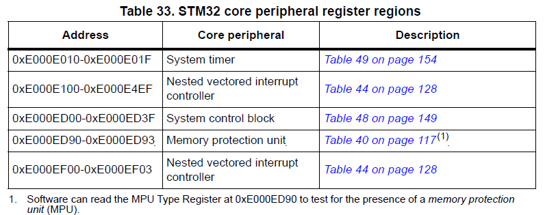
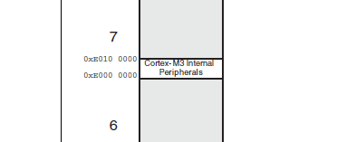
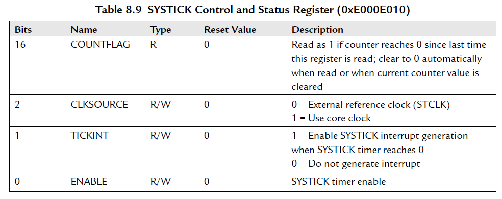
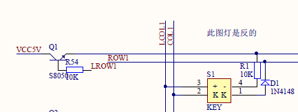

# Github上开源的DIY键盘代码详解
这几天一直在看键盘，偶然在网上看到了某位发布的GIthub开源的键盘程序。我之前学过几天单片机，下面我就记录一下我这个菜鸟级别的代码分析。  
在这个分析中我打算采用超级精细逐句的分析（- -！ 幸好作者的源码不多）。

[源码GitHub仓库](https://github.com/BG2CRW/CoopBoard )

## main 函数
打算全面研究程序，当然要从这个开始看啦。
1. `delay_init(72);	//初始化延时函数`  
	在这个函数中作者的注释为初始化延时，下面进入函数一探究竟。  
	```c
	void delay_init(uint8_t SYSCLK)
	{
		SysTick->CTRL &= 0xfffffffb;	//bit2清空，选择外部时钟HCLK/8，停止计数
		fac_us = SYSCLK/8;	//系统时钟的1/8		    
		fac_ms = (uint16_t)fac_us*1000;	//ms需要的SysTick时钟数
	}
	```
	好了，我们来看这个SysTick。这个是一个被强制转换类型的地址。 原型  
	`#define SysTick             ((SysTick_Type *)       SysTick_BASE)`  
	```c
	typedef struct
	{
	  __IO uint32_t CTRL; 
	  __IO uint32_t LOAD; 
	  __IO uint32_t VAL;  
	  __I  uint32_t CALIB;
	} SysTick_Type;
	```
	这下就明白了，这是通过一个将SysTick_BASE强转成一个结构体类型，每个成员占32个bit。这样给各个寄存器赋值的时候就方便多啦。  
	SysTick_BASE的地址在STM32F1编程手册4.1节中可以找到。  
	
	由此可见SysTick_BASE的地址为0xE000 E010,事实也的确如此。  
	` #define SysTick_BASE        (SCS_BASE +  0x0010)  //The SCS_BASE == 0xE000 E000`  
	然后这里从STM32数据手册中找到内存划分图,看到0xE000 0000 ~ 0xE010 0000属于内部外设，如下：  
	  
	再从《Cortex-M3权威指南》中找到关于SysTick寄存器的说明:  
	  
	在这里就验证了上面代码中注释的含义。同时该函数还初始化了两个全局变量。  

	.	`USART1_Init(9600);	//初始化串口1`  
	回到main函数。第二个函数是初始化串口函数。
	关于STM32串口初始化网上有太多的写的很好的相关文章了。

3. `void KEY_Init(void)`
	在此处，作者使用了STM32的库函数编程方式。网上资料也是比较多的。
	[STM32 8种引脚模式](https://blog.csdn.net/zczx29/article/details/79718528)
	关于按键的引脚配置。这些配置需要参考电路设计。在该源码中，之前的作者也发布了电路原理图，以及PCB图。**其内容在SCHDOC目录下**。从原理图上看，原作者对键盘按键的设计采用了行列扫描的方式。继续看源码。  
	```c
	RCC_APB2PeriphClockCmd(RCC_APB2Periph_GPIOC,ENABLE);//ROW1\2\3\4\5\6
	GPIO_InitStructure.GPIO_Mode = GPIO_Mode_Out_PP;       
	GPIO_InitStructure.GPIO_Speed= GPIO_Speed_50MHz;
	GPIO_InitStructure.GPIO_Pin  = GPIO_Pin_0|GPIO_Pin_1|GPIO_Pin_2|GPIO_Pin_3|GPIO_Pin_4|GPIO_Pin_5;
  	GPIO_Init(GPIOC,&GPIO_InitStructure);
	RCC_APB2PeriphClockCmd(RCC_APB2Periph_GPIOB,ENABLE);//COL1\2\3\4\5\6\7\8\9\10\11
	GPIO_InitStructure.GPIO_Mode = GPIO_Mode_IPU;       
	GPIO_InitStructure.GPIO_Speed= GPIO_Speed_50MHz;
	GPIO_InitStructure.GPIO_Pin  = GPIO_Pin_0|GPIO_Pin_1|GPIO_Pin_3|GPIO_Pin_4|GPIO_Pin_5|GPIO_Pin_6|GPIO_Pin_7|GPIO_Pin_8|GPIO_Pin_9|GPIO_Pin_10|GPIO_Pin_11;
  	GPIO_Init(GPIOB,&GPIO_InitStructure);
	```
	上述代码，作者将PC0、1、2、3、4、5设置成推挽输出，将PB0、1、2、3、4、5、6、7、8、9、10、11设置为上拉输入。PC6、7、8也设置成为了上拉输入。

4. `ROW1=0;`  
	```c
	#define ROW1 PCout(0)	// PC0
	#define PCout(n)      BIT_ADDR(GPIOC_ODR_Addr,n)
	#define GPIOC_ODR_Addr        (GPIOC_BASE+12)	
	#define GPIOC_BASE            (APB2PERIPH_BASE + 0x1000)
	#define APB2PERIPH_BASE       (PERIPH_BASE + 0x10000)
	#define PERIPH_BASE           ((uint32_t)0x40000000)
	```
	就是一大堆的宏定义，这段的意思是说，将PC0输出个低电平。其中GPIOC_BASE+12中的+12指的是端口输出寄存器的偏移地址。[关于对寄存器等介绍的知识](https://blog.csdn.net/geek_monkey/article/details/86291377)。  

5. `if(DFU_Button_Read() == 1)//enter APP`
	在这个函数中就是对COL1也就是对PB0引脚的电平读取。上一行代码将PC0输出低。这行代码对PB0读电平。从原理图上来看就是判断了某个键位的动作。如下图当图中键被按下的时候，COL1会被拉低，从而得到一个低的电平。
	  

	. `if(((*(__IO uint32_t*)ApplicationAddress) & 0x2FFE0000 ) == 0x20000000)	//检测APP地址是否合法`
	这一行的代码其实注释也已经说的比较清楚了。但是我们还是要探个究竟。  
	`#define ApplicationAddress 0x08030000`