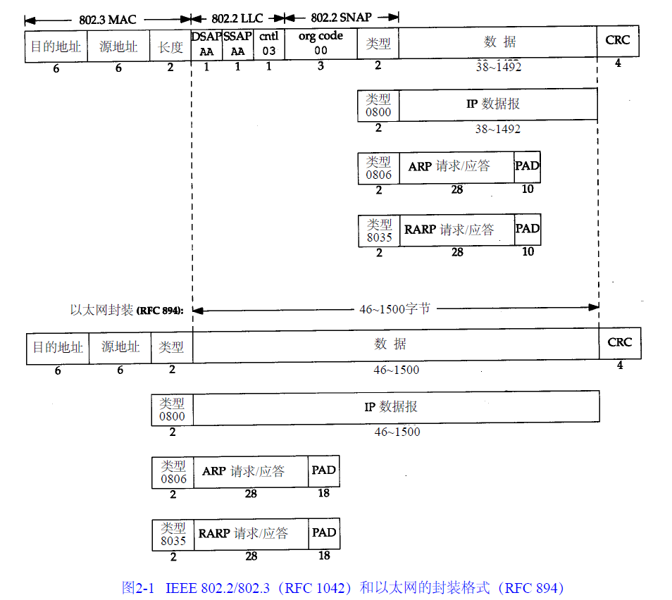
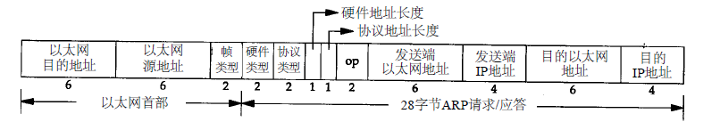

# linux 下实现 arp  


## 数据包结构  

  

  上图位arp包结构


> The value 60 printed after the words arp and ip on each of the five lines is the length of the Ethernet frame. Since the size of an ARP request and ARP reply is 42 bytes (28 bytes for the ARP message, 14 bytes for the Ethernet header), each frame has been padded to the Ethernet minimum: 60 bytes.	this minimum of 60 bytes starts with and includes the 14-byte Ethernet header, but does not include the 4-byte Ethernet trailer. Some books state the minimum as 64 bytes, which includes the Ethernet trailer.	------《tcp/ip 卷1》   

简单点就是说，算上以太网头和尾一共需要64字节的数据。    


## 创建套接字  

发送网络包必须首先要创建套接字，地球人都知道！ 发送arp的sock创建和一般的tcp/udp的是不太一样的。  
`sockFd = socket(AF_PACKET, SOCK_RAW, htons(ETH_P_ARP));`  
AF_PACKET是发送底层包的接口，此处建议仔细阅读man socket(2) 以及 man packet(7)，下面将贴出其中内容。  

>AF_PACKET           Low level packet interface       packet(7)    

man socket(2) 对AF_PACKET参数的解释。 下面是man packet(7)的关键内容。  

>The socket_type is either SOCK_RAW for raw packets including the  link-level  header  or  SOCK_DGRAM  for cooked  packets  with the link-level header removed.  The link-level header information is available in a common format in a sockaddr_ll structure.  protocol is the IEEE 802.3 protocol  number  in  network  byte order.  See the <linux/if_ether.h> include file for a list of allowed protocols.  When protocol is set to htons(ETH_P_ALL), then all protocols are received.  All incoming packets of that protocol  type  will  be passed to the packet socket before they are passed to the protocols implemented in the kernel.
In  order to create a packet socket, a process must have the CAP_NET_RAW capability in the user namespace that governs its network namespace.
SOCK_RAW packets are passed to and from the device driver without any changes in the packet  data.   When receiving  a  packet, the address is still parsed and passed in a standard sockaddr_ll address structure. When transmitting a packet, the user-supplied buffer should  contain  the  physical-layer  header.   That packet  is  then  queued  unmodified  to  the  network driver of the interface defined by the destination address.  Some device drivers always add other headers.  SOCK_RAW is similar to but not  compatible  with the obsolete AF_INET/SOCK_PACKET of Linux 2.0.
SOCK_DGRAM  operates  on  a  slightly  higher level.  The physical header is removed before the packet is passed to the user.  Packets sent through a SOCK_DGRAM packet socket get a suitable physical-layer header  based on the information in the sockaddr_ll destination address before they are queued.
 By  default,  all  packets  of the specified protocol type are passed to a packet socket.  To get packets only from a specific interface use bind(2) specifying an address in a  struct  sockaddr_ll  to  bind  the packet  socket to an interface.  Fields used for binding are sll_family (should be AF_PACKET), sll_proto‐col, and sll_ifindex.  

里面大体上较清楚了许多问题问题。  
- socket_type 这个参数，如果选择SOCK_RAW就是自己填写链路帧头。而SOCK_GDRAM系统帮助填写链路帧的头。  
- sockaddr_ll 结构提供通用的链路头结构。（后面说这个结构）  
- 收到的数据包先于内核处理  
- SOCK_RAW数据包与设备驱动之前的传递是不加修改的  
- 数据包在接收时，仍以通用的sockaddr_ll结构收到  
- 有一些驱动程序会擅自添加头部  
- 如果要指定数据包的传送从特定的接口，则需要使用bind函数绑定sockaddr_ll结构来实现。需要填充sll_family = AF_PACKET , sll_portocol, sll_ifindex。  

先说 sll_ifindex 这个是网络接口索引号。对于这个东西可以使用  
`if_nametoindex  和 if_indextoname`  
这两个函数。他们的头文件是<net/if.h>。  
**还有就是要注意字节序的问题，超过一个字节以上的连续数据需要使用htons函数进行转换位网络字节序**  

下面记录一下 socketaddr  socketaddr_in  socketaddr_ll 这三个结构  

```c
linux-5.0.1\include\uapi\linux\if_packet.h

struct sockaddr_ll {
               unsigned short sll_family;   /* Always AF_PACKET */
               unsigned short sll_protocol; /* Physical-layer protocol */
               int            sll_ifindex;  /* Interface number */
               unsigned short sll_hatype;   /* ARP hardware type */
               unsigned char  sll_pkttype;  /* Packet type */
               unsigned char  sll_halen;    /* Length of address */
               unsigned char  sll_addr[8];  /* Physical-layer address */
};

linux-5.0.1\include\uapi\linux\in.h

struct sockaddr_in {
  __kernel_sa_family_t	sin_family;	/* Address family		*/
  __be16		sin_port;	/* Port number			*/
  struct in_addr	sin_addr;	/* Internet address		*/

  /* Pad to size of `struct sockaddr'. */
  unsigned char		__pad[__SOCK_SIZE__ - sizeof(short int) -
			sizeof(unsigned short int) - sizeof(struct in_addr)];
};

linux-5.0.1\include\linux\socket.h

struct sockaddr {
	sa_family_t	sa_family;	/* address family, AF_xxx	*/
	char		sa_data[14];	/* 14 bytes of protocol address	*/
};
```
sockaddr sockaddr_in的区别就是sockaddr_in内容更加的解耦。使得地址组和端口号分离，更加便于操作。而sockaddr_ll是链路层帧头的通用结构。   
参考文章:  
- [ifreq socketaddr sockaddr_in实例详解](https://blog.csdn.net/dosthing/article/details/80378947)  
- [sockaddr_in , sockaddr , in_addr区别Socket编程函数集](https://blog.csdn.net/maopig/article/details/17193021)  

而ETH_P_ARP等协议号的宏在 linux-5.0.1\include\uapi\linux\if_ether.h 中定义。  

## 发送和接收数据包  

> SOCK_DGRAM and SOCK_RAW sockets allow sending of datagrams to correspondents named  in  sendto(2)  calls. Datagrams are generally received with recvfrom(2), which returns the next datagram along with the address of its sender.    --------man socket(2) 
> 
其中说明了如果要是指定类型为SOCK_RAW接收和发送就应该使用sendto和recvfrom函数。这时因为sendto是面向无连接状态的sock发送的函数。详见man sendto(2)。  
`sendto(sockFd,arpFrame,sizeof(struct arp_frame),0,(struct sockaddr *)&to,sizeof(to))`  
将构建好的sockaddr_in函数填入就可以完成发送了。  
sendto原型：  
`ssize_t sendto(int sockfd, const void *buf, size_t len, int flags,const struct sockaddr *dest_addr, socklen_t addrlen);`  

**发送：**  
recvfrom原型：  
`ssize_t recvfrom(int sockfd, void *buf, size_t len, int flags,struct sockaddr *src_addr, socklen_t *addrlen);`  

前面已经说过，通过解析src_addr就可以获取对方的相关信息了。


## 其他  

可用 inet_addr 一组函数来完成字符串ip地址到ip地址结构的转换。详见 man inet_addr(3)
