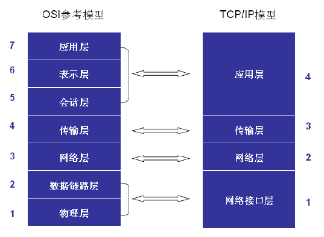
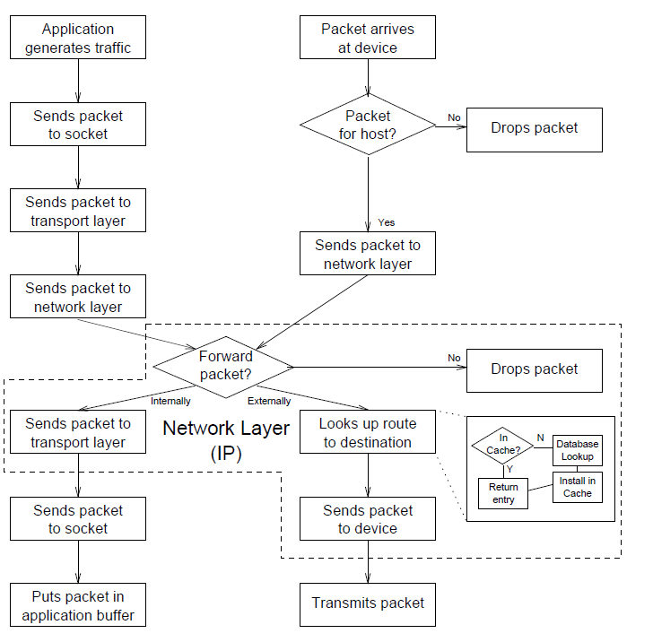
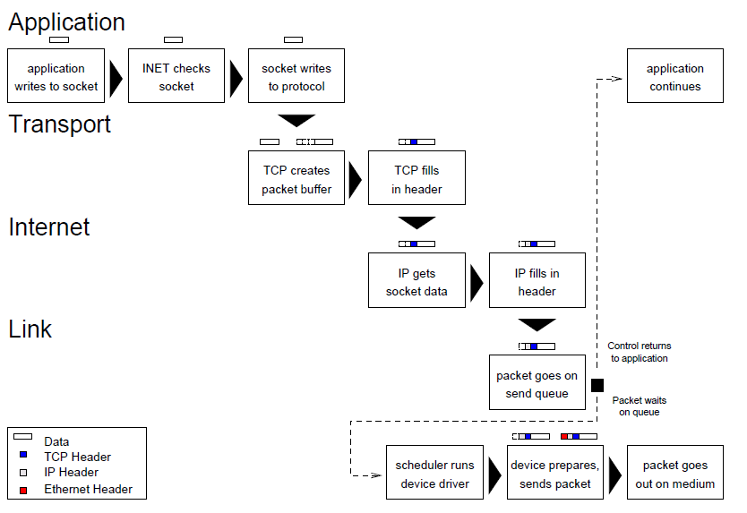
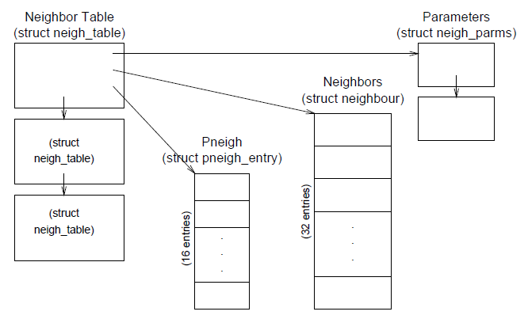

# Linux Net 读书笔记
> 专业书要认真看！慢慢的看！不要追求速度！   ------对自己的要求  

首先让OSI模型和TCP/IP模型编程一种潜意识，而不是要从记忆中搜索。。  

  

## 第二章
第一小节重点说了一下网络传输的流程：  
	在发送方由应用程序完成原始数据的生成后，交给传输层后再交给网路层。由内核检查发送端口，检查一下自己的转发表，看看是不是给另外一台机机器的。若是就交给链路层由网卡发送数据。
	当数据通过网络链路传输到另外一个机器时候，检查一下这个包要发送的端口。然后交给IP层处理，看看这个包的目的地是哪里。如果这个包是发给别的机器的，那么就还给输出接口。如果这个包目的地就是一个本机的应用程序的话，就交给传输层处理。最终以socket的形式交给应用程序。 


**对应过程，结合上图可以得出下图： **
  

**第二节**是介绍了一下内核的协议栈。  
	IP的主要作用是在网络层的。负责检查数据包发送的是不是计算机指定的端口，或者是要对数据包进行转发。IP协议还可能会整理数据包，或者发送给链路层，或是交给传输层处理。  
	TCP和UDP作用在传输层，但是和UDP进行简单的传输不同，TCP可以对数据包进行修复处理(recovery mechanisms)和传输管理控制。特别在linux-net中说明，TCP&UDP都把内核空间的socket中的内容拷贝到了用户空间。同时也都是应用和网络之间的桥梁（不知道理解的对不对）。  
	INET是IP中的特殊socket，用来具体执行读、写、连接。作为应用和传输层的中间层。
	BSD socket是INET内容更加抽象的结构，应用程序读写BSD socket时，在INET socket操作中BSD socket进行转化、翻译操作。
	应用层就是最顶层了，其可以进行简单的连接或者像路由信息协议一样复杂。

**第三节**介绍数据包的结构  
	严格的执行分层的协议可以减少时间上的浪费。linux-net说。数据还是被拷贝了两次，第一次是从用户空间到内核空间，第二次是从内核空间到输出的媒介（但是还是存在拷贝的呀）。
	然后传输协议在输出缓区创建数据结构，设备驱动在有新数据到来的时候创建数据结构。

**第四节**因特网路由  
	这块得内容比较长（是我得英语不好!)

## 第三章 网络初始化

linux初始化路由表的时候是在电脑启动的时候。即使是单机（stand-alone）设备也会初始化路由表，只要它启用了本地回环（loopback device）。这章节介绍了相关的配置文件和ifconfig等函数。  

## 第四章 网络连接  
在linux中socket是由两个结构体进行描述的，这两个结构体在应用connect的时候就会初始化，但是其内容则是由IP层去获得并且填写进结构体当中。  

### scoket structures  
主要的两个结构体就是BSD和IENT，而且他们两个之间的关联特别强。INENT结构是包含BSD结构的。BSD定义在 *include/linux/socket.h* 中。  
- **struct proto_ops *ops** 这是个指向协议的细节中socket行为函数的指针。例：ops->sendmsg 是指向inet_sendmsg()函数的指针。
- **struct inode *inode** 指向socket关联的inode的指针。
- **struct sock *sk** 指向BSD关联的INET结构关联的指针。  

**INET结构体** 这是一个很重要很多变化结构。  
- **struct sock *next, *pprev** 全部的socket和各种协议值之间的桥梁。  
- **struct dst_entry *dst_cache** 指向路径就是描述send packets的。
- **struct sk_buff_head receive_queue** 指向接收队列。  
- **struct sk_buff_head write_queue**   
- __u32 saddr 源网络地址  
- **struct proto *prot** 这个结构中是指向传输层协议有特殊功能的函数，例如：
	`prot->recvmsg` 是指向tcp-v4-recvmsg()函数的。  
- union strct tcp_op af_tcp; tp_pinfo - TCP options for this socket  
- **struct socket* sock** 指向BSD的指针

### Connetion Processes

这章节主要介绍了几个函数  

```c
/* looks up host */
server = gethostbyname(SEVERNAME);
/* get socket */
sockfd = socket(AF_INT, SOCK_STEAM, 0);
/* set up address */
address.sin_family = AF_INIT;
address.sin_port   = htons(PORT_NUM);
memcpy(&address.sin_addr, server->h_addr, server->h_lenght);
/* connect to server */
connect(sockfd, &address, sizeof(address));
```

**socket call walk-through**
- 检查调用过程中的错误
- 为创建cocket对象创建空间
- 将socket加入INODE列表
- 关联协议处理函数
- 保存socket类型与协议类型
- 设置socket为关闭状态
- 初始化数据包队列  

----
**connect call walk-through**
- 检查错误
- 确定路径描述
	- 检查路由表现有的条目
	- 在FIB中找到目标
	- 创建新的路由表条目
	- 将新的条目放如路由表中并返回

- 在socket中储存指向路径条目的指针
- 调用协议中特定的处理函数
- 设置socket状态为已建立

----

**close call walk-through**  
- 检查错误（比如，这个socket是否存在）
- 设置socket状态为disconnect，防止继续使用
- 针对不同的协议动作
- 释放socket数据结构（TCP/UDP and INET）
- 从INODE列表中移除socket
  
## 4.5 Linux Function  

	这节就厉害了，全面介绍了源码在内核中的位置以及他们都干了什么！  

## 第五章 send the messages  

  

**creating a packet to UDP**  
- 检查错误。比如：数据是不是过大？这个连接是不是UDP连接
- 确定路径目标（如果路径没有创建，就调用IP routing 去创建）
- 为数据包创建UDP信息头部
- 调用IP建立与发送函数
  
**creating a packet with TCP**  
- 检查连接，是否建立，是否打开，socket套接字是否正常工作
- 检查时候需要合并数据包或者拆分数据包
- 创建数据缓冲区
- 从用户拷贝数据到缓冲区
- 将数据包添加至未绑定的队列中
- 添加TCP信息头部
- 调用IP层传输模块

**wraping a packet in IP**  
- 如果是UDP则，创建数据包缓冲区
- 如果是TCP， 查找目的路径
- 填充IP头部
- 从用户空间拷贝头部传输头部和包数据
- 发送包到目的路径的驱动的输出函数

**Transmitting a packet**  
- 发送数据包到驱动的输出队列
- 唤醒驱动
- 等待得到cpu调度
- 驱动检查传输媒介
- 添加链路头部
- 调用总线将数据包发送至媒介

## 第六、第七章待补充  

## 第八章  Basic Internet Protocol Routing   

*这章中假定的计算机是一个连接在局域网中，另一台连接到 Internet 上，彼此之间有连接。*  

**重点开始！**
	neighbor table 中记录了计算机硬件的主机上的连接。其中的信息包括了，设备连接对应的neighbor，以及使用何种协议去交换数据。linux使用Address Resolution Protocol（ARP），去维护和更新neighbor上的数据。数据被动态的添加在nrighbor上，但是如果到达某些时间而不去使用，数据则会最终失效(eventually disappear), 管理员也可以设置数据是长期有效的。  
	Linux设置两张复合的routing table去维护IP address。一个是通用的转发信息表（Forwarding Information Base---FIB）记录了全部地址的路径，另一个是一个很小但是素的很快的couting cache对那些频繁使用的路径使用。Ip需要找到对应的路径的时候会首先找cache而后在FIB中搜索。如果在FIB中搜索到，则将该条目添加到cache中。如果cache中的条目长期未被使用，那就将被淘汰。  
	
### Routing table  
**要注意字节序的问题**(host byte order  and  network byte order)  

neighbor table:  
-----
  

	neighbor table中的表项并不是持久的，在近期没有接入网络的情况下可能是空的表，在近期所有连接都是在几个计算机之间的，该表中可能记录了计算机的物理连接。该表中包括了地址、驱动、协议和状态信息。
	struct neigh_table *neight_tables 作为全局指针指向neightbor table。其中包括了一套常用的函数和数据以及哈希表，关于整套neightbor的细节信息。底层表包括例如传输的大致时间、队列长度、驱动指针、和一一些驱动函数的详细信息。

## 内容有点干吧，都是对函数进行说明，回头再看。去看linux网络编程


