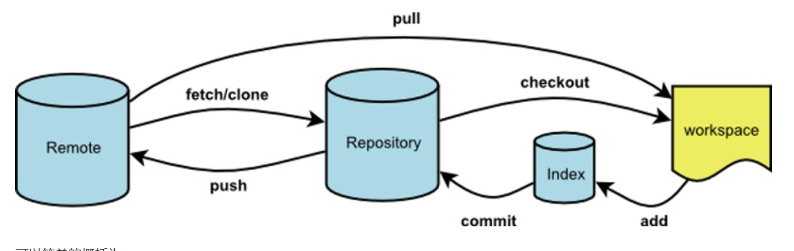

# git 备忘

## 便于理解的图  


  


## 强制覆盖本地与提交

```shell
git push -f orgin master	#强制提交
 
git fetch -all				#强制覆盖本地
git -reset --hard origin/master
```

## 远程仓库删除文件或者文件夹  

```shell
git pull origin master		#拉取远程仓库项目
git rm -r --cached target	#删除target文件夹
git commit -m 删除了target文件夹
git push -u orgin master	#提交文件
```

## 获得帮助

```shell
git --help		#简短帮助
git help -a		#详细git命令
git help <command>	#获得command的详细内容，会从网页打开
```

##  同步远端仓库

```shell
git remote -v		#查看与其他仓库之间的连接
git fetch <remote>	#remote 就是上一个命令中看到的远程仓库url的名字
git merge <remote>	#合并到本地文件
```

## 解决冲突 （待实践）

**假设场景** ： A和B都从远端仓库拉取了代码进行修改。提交的时候A先提交了，这时B再提交就会失败，原因是服务器上的代码和他拉下来的时候已经不一样了。  

**解决** ：  
```shell
git pull		#拉取最新的代码,这时候就会显示那个文件是冲突的(conflict)
git status 		#可能也会显示冲突的代码。
#去那几个文件中修改代码，把git自动填的体现冲突的符号一并删除
git add <file>
git commit -m 解决冲突
git push
```

## 提交代码到自己的远端仓库

```shell
git add --all	#把所有修改的都添加到缓存区
git commit -m 	#我要提交了
git push		#搞定！
```

。

