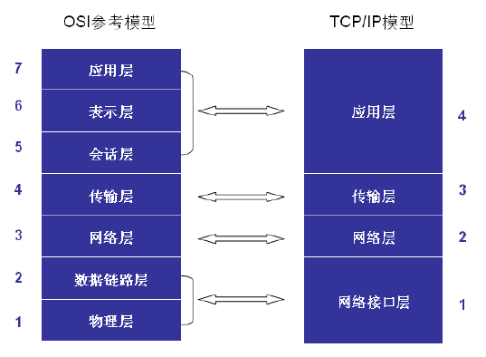
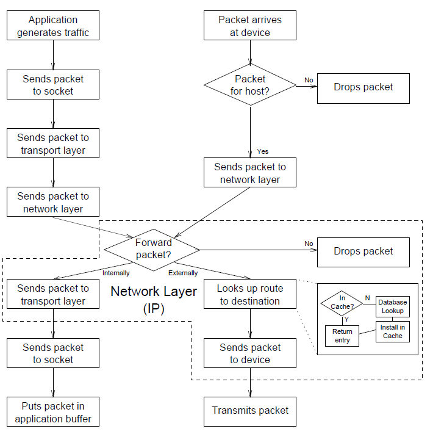

# Linux Net 读书笔记
> 专业书要认真看！慢慢的看！不要追求速度！   ------对自己的要求  

首先让OSI模型和TCP/IP模型编程一种潜意识，而不是要从记忆中搜索。。  

  

## 第二章
第一小节重点说了一下网络传输的流程：  
	在发送方由应用程序完成原始数据的生成后，交给传输层后再交给网路层。由内核检查发送端口，检查一下自己的转发表，看看是不是给另外一台机机器的。若是就交给链路层由网卡发送数据。
	当数据通过网络链路传输到另外一个机器时候，检查一下这个包要发送的端口。然后交给IP层处理，看看这个包的目的地是哪里。如果这个包是发给别的机器的，那么就还给输出接口。如果这个包目的地就是一个本机的应用程序的话，就交给传输层处理。最终以socket的形式交给应用程序。 

**对应过程，结合上图可以得出下图： **
  

**第二节**是介绍了一下内核的协议栈。  
	IP的主要作用是在网络层的。负责检查数据包发送的是不是计算机指定的端口，或者是要对数据包进行转发。IP协议还可能会整理数据包，或者发送给链路层，或是交给传输层处理。  
	TCP和UDP作用在传输层，但是和UDP进行简单的传输不同，TCP可以对数据包进行修复处理(recovery mechanisms)和传输管理控制。特别在linux-net中说明，TCP&UDP都把内核空间的socket中的内容拷贝到了用户空间。同时也都是应用和网络之间的桥梁（不知道理解的对不对）。  
	INET是IP中的特殊socket，用来具体执行读、写、连接。作为应用和传输层的中间层。
	BSD socket是INET内容更加抽象的结构，应用程序读写BSD socket时，在INET socket操作中BSD socket进行转化、翻译操作。
	应用层就是最顶层了，其可以进行简单的连接或者像路由信息协议一样复杂。

**第三节**介绍数据包的结构  
	严格的执行分层的协议可以减少时间上的浪费。linux-net说。数据还是被拷贝了两次，第一次是从用户空间到内核空间，第二次是从内核空间到输出的媒介（但是还是存在拷贝的呀）。
	然后传输协议在输出缓区创建数据结构，设备驱动在有新数据到来的时候创建数据结构。

**第四节**因特网路由  
	这块得内容比较长（是我得英语不好!)

## 第三章 网络初始化

linux初始化路由表的时候是在电脑启动的时候。即使是单机（stand-alone）设备也会初始化路由表，只要它启用了本地回环（loopback device）。这章节介绍了相关的配置文件和ifconfig等函数。  

## 第四章 网络连接  
在linux中socket是由两个结构体进行描述的，这两个结构体在应用connect的时候就会初始化，但是其内容则是由IP层去获得并且填写进结构体当中。  

### scoket structures  
主要的两个结构体就是BSD和IENT，而且他们两个之间的关联特别强。INENT结构是包含BSD结构的。BSD定义在 *include/linux/socket.h* 中。  
- **struct proto_ops *ops** 这是个指向协议的细节中socket行为函数的指针。例：ops->sendmsg 是指向inet_sendmsg()函数的指针。
- **struct inode *inode** 指向socket关联的inode的指针。
- **struct sock *sk** 指向BSD关联的INET结构关联的指针。  

**INET结构体** 这是一个很重要很多变化结构。  
- **struct sock *next, *pprev** 全部的socket和各种协议值之间的桥梁。  
- **struct dst_entry *dst_cache** 指向路径就是描述send packets的。
- **struct sk_buff_head receive_queue** 指向接收队列。  
- **struct sk_buff_head write_queue**   
- __u32 saddr 源网络地址  
- **struct proto *prot** 这个结构中是指向传输层协议有特殊功能的函数，例如：
	`prot->recvmsg` 是指向tcp-v4-recvmsg()函数的。  
- union strct tcp_op af_tcp; tp_pinfo - TCP options for this socket  
- **struct socket* sock** 指向BSD的指针

dsa 

